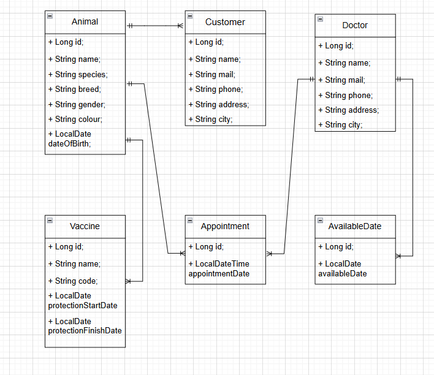

# VetManagementSystem

A comprehensive veterinary management backend system built with **Spring Boot**. This system streamlines management of animals, customers, doctors, appointments, doctor availability, and vaccines with robust validation, pagination, and error handling.

---

## Table of Contents

- [Project Overview](#project-overview)
- [Technologies](#technologies)  
- [Architecture & Structure](#architecture--structure)
- [Entity Relationship Diagram](#entity-relationship-diagram)
- [API Structure & Endpoints](#api-structure--endpoints)  
- [Key Features](#key-features)  
- [Validation and Business Rules](#validation-and-business-rules)  
- [Exception Handling Strategy](#exception-handling-strategy)  
- [Technical Challenges & Solutions](#technical-challenges--solutions)
- [What I Learned & Key Takeaways](#what-I-learned-and-key-takeaways)
- [Future Enhancements](#future-enhancements)  


---

## Project Overview

VetManagementSystem backend provides RESTful APIs enabling veterinary clinics to:

- Manage CRUD operations for Animals, Customers, Doctors, Appointments, Available Dates, and Vaccines.
- Enforce domain-specific rules to maintain data integrity.
- Support pagination and filtering to efficiently handle large datasets.
- Deliver consistent API response formats.
- Handle exceptions globally to provide meaningful feedback.

---

## Technologies

- **Programming Language:** Java 17  
- **Framework:** Spring Boot 3.x  
- **Persistence:** Spring Data JPA (Hibernate)  
- **Database:** PostgreSQL (configurable)  
- **Validation:** Jakarta Bean Validation (JSR-380)  
- **Mapping:** ModelMapper  
- **Build Tool:** Maven  
- **Dependency Injection:** Spring Core   
---

## Architecture & Structure
```
The project follows a layered architecture to separate concerns clearly:
VetManagementSystem/
├── postman/
│   └── SametCevik.postman_collection.json  # Postman collection                 
├── controller/              # REST Controllers, define endpoints and handle HTTP requests
├── service/                 # Business logic layer (interfaces + implementations)
│   ├── abstracts/
│   └── concretes/
├── dao/                     # Spring Data JPA repositories (data access layer)
├── dto/                     # Data Transfer Objects for requests & responses
├── entities/                # JPA entity models mapped to database tables
├── exception/               # Custom exceptions and global exception handler
├── core/                    # Utility classes (e.g. ModelMapper config, Result wrapper)
└── VetManagementSystemApplication.java # Main Spring Boot entry point
```

---

## Entity Relationship Diagram



## API Structure & Endpoints

The project includes a [Postman collection](./SametCevik.postman_collection.json) to test endpoints

### Animals
- `POST /v1/animals` — Create a new animal  
- `GET /v1/animals/{id}` — Get animal by ID  
- `PUT /v1/animals` — Update animal  
- `GET /v1/animals` — Get paged list of animals  
- `GET /v1/animals/filter?name=xxx` — Search animals by name  
- `GET /v1/animals/by-customer/{customerId}` — Get animals of a specific customer

### Customers
- `POST /v1/customers` — Create customer  
- `GET /v1/customers/{id}` — Get customer by ID  
- `PUT /v1/customers` — Update customer  
- `GET /v1/customers` — Paginated customer list  
- `GET /v1/customers/filter?name=xxx` — Search customers by name

### Doctors
- `POST /v1/doctors` — Create doctor  
- `GET /v1/doctors/{id}` — Get doctor by ID  
- `PUT /v1/doctors` — Update doctor  
- `GET /v1/doctors` — Paginated doctor list

### Appointments
- `POST /v1/appointments` — Schedule appointment  
- `GET /v1/appointments/{id}` — Get appointment by ID  
- `PUT /v1/appointments` — Update appointment  
- `GET /v1/appointments` — Paginated appointment list  
- `DELETE /v1/appointments/{id}` — Delete appointment  
- `GET /v1/appointments/search/by-doctor` — Search appointments by doctor and date range  
- `GET /v1/appointments/search/by-animal` — Search appointments by animal and date range  

### Available Dates (Doctor availability)
- `POST /v1/available-dates` — Add available date for doctor  
- `GET /v1/available-dates/{id}` — Get available date by ID  
- `PUT /v1/available-dates` — Update available date  
- `GET /v1/available-dates` — Paginated list of available dates  
- `DELETE /v1/available-dates/{id}` — Delete available date  

### Vaccines
- `POST /v1/vaccines` — Add vaccine record for animal  
- `GET /v1/vaccines/{id}` — Get vaccine by ID  
- `PUT /v1/vaccines` — Update vaccine  
- `GET /v1/vaccines` — Paginated vaccine list  
- `DELETE /v1/vaccines/{id}` — Delete vaccine  
- `GET /v1/vaccines/expiring?startDate=yyyy-MM-dd&finishDate=yyyy-MM-dd` — List vaccines with protection expiring between dates   
- `GET /v1/vaccines/by-animal/{id}` — Paginated vaccines for animal

---

## Key Features

- **Robust Validation:** Appointment times validated to be on the hour and to prevent overlapping; vaccine duplication avoided based on protection periods.  
- **Consistent Responses:** All endpoints respond with standardized wrappers (`ResultData` / `Result`) supporting success and error messages.  
- **Pagination & Filtering:** Support for pageable queries and filters for large data sets, improving API performance.  
- **DTO Mapping:** Clear separation of internal entity models and exposed DTOs for requests/responses using ModelMapper.  
- **Exception Handling:** Global exception handlers return appropriate HTTP status codes and meaningful error messages.

---

## Validation and Business Rules

- **Appointment Scheduling:**
  - Time must be on the hour (e.g., 14:00, 15:00).  
  - Doctor must be available on the appointment date.  
  - No overlapping appointments for the same doctor at the same time.  
- **Available Dates:**
  - Prevent duplicate available dates for the same doctor.  
- **Vaccine Records:**
  - Prevent multiple active vaccines (same name and code) with overlapping protection for an animal.  
- **Customer and Doctor Emails:**
  - Must be unique in the system to avoid conflicts.

---

## Exception Handling Strategy

- **Custom Exceptions:**  
  - `NotFoundException` — When requested resources are missing.  
  - `ConflictException` — When a resource conflicts with existing data (e.g., duplicate email, overlapping vaccine).
  - `AppointmentAlreadyExistsException` — Thrown when an appointment is attempted to be scheduled at a time that already has an existing appointment for the same doctor.
  - `AppointmentDateException` — Thrown when an appointment is scheduled on a date when the doctor is not available (i.e., not in their available dates).
  - `AppointmentTimeException` — Thrown when the appointment time is invalid, such as being outside of working hours or in the past.
- **Global Exception Handler:**  
  - Catches exceptions and responds with consistent JSON structure containing status code, timestamp, message, and request details.  
- **HTTP Status Codes:**  
  - `201 Created` for successful POST operations.  
  - `200 OK` for successful GET, PUT, DELETE operations.  
  - `400 Bad Request` for validation failures.  
  - `404 Not Found` if resource does not exist.  
  - `409 Conflict` for data conflicts.

---

## Technical Challenges & Solutions

### Robust Appointment Scheduling

**Challenge:**  
Prevent scheduling appointments on invalid times, dates when the doctor is unavailable, or when overlapping with existing appointments.

**Solution:**  
The `AppointmentService` enforces:
- Appointment times must align to full hours (e.g., `10:00`, not `10:15`) by validating `LocalDateTime.getMinute() == 0`.
- The doctor must have a predefined available date (`AvailableDate`) for the appointment day.
- Conflict detection is performed using `existsByDoctorIdAndAppointmentDate`, throwing `AppointmentAlreadyExistsException` if a match is found.

This prevents accidental overlaps and enforces working hour rules.

---

### Preventing Duplicate Vaccine Records

**Challenge:**  
Ensure that an animal doesn't receive multiple overlapping vaccines with the same code while one is still active.

**Solution:**  
Before saving a new vaccine, the system:
- Queries the database for existing vaccines with matching `code` and `name` for the same animal.
- Validates the new vaccine’s `protectionStartDate` is after the `protectionFinishDate` of any existing matching vaccine.
- If overlapping is detected, it raises a `ConflictException` with a clear message.

This avoids redundant or medically invalid vaccination data.

---

### Pagination & Filtering for Large Datasets

**Challenge:**  
Enable efficient browsing and querying of potentially large datasets like animals, customers, and appointments.

**Solution:**  
The project uses Spring Data JPA’s `Page<T>` abstraction with custom endpoints supporting:
- Query parameters: `page`, `pageSize`
- Filtering by name (`findByNameContainingIgnoreCase`)
- Paginated and sorted data returned with metadata via a custom `CursorResponse<T>` wrapper

This ensures scalable and efficient API usage, especially for frontend integration.

---

### Consistent & Predictable API Responses

**Challenge:**  
Deliver a standardized and developer-friendly API, reducing ambiguity for client applications.

**Solution:**  
All API responses are unified using:
- `Result` for basic success/failure responses
- `ResultData<T>` for success responses with data
- `GlobalExceptionHandler` using `@ControllerAdvice` for consistent error objects (`ApiResponseError`)
- Custom exceptions like `NotFoundException`, `AppointmentTimeException` to encapsulate business rules

This improves client-side error handling and debuggability.

---

### Object Mapping Between DTO and Entity Layers

**Challenge:**  
Avoid tight coupling between entities and API layers while keeping the code DRY (Don't Repeat Yourself).

**Solution:**  
The project uses a custom `IModelMapperService` abstraction over ModelMapper:
- Configured with different matching strategies (`STANDARD` for request DTOs, `LOOSE` for response DTOs)
- Ensures flexibility and automatic mapping between nested objects and flat DTOs

This simplifies service logic and reduces manual field assignments.

---

### Input Validation at API Level

**Challenge:**  
Prevent invalid data (nulls, empty fields, wrong formats) from reaching the service and persistence layers.

**Solution:**  
All request DTOs are annotated with Jakarta Validation constraints such as:
- `@NotNull`, `@NotBlank`, `@Positive`, `@Email`
- `@Valid` is enforced in controllers via `@RequestBody`

Combined with global error handling, this ensures clean data entry and meaningful error messages to the client.

---

### Cascade Operations and Referential Integrity

**Challenge:**  
Ensure proper cascading behavior when deleting parent entities like Customers, Doctors, or Animals.

**Solution:**  
All entity relationships are configured with:
- `cascade = CascadeType.REMOVE` for `@OneToMany` fields
- Foreign keys with `nullable = false` in `@JoinColumn` to enforce integrity

For example, when a customer is deleted, all their animals and related appointments and vaccines are also deleted automatically, preventing orphan records.

---

## What I Learned & Key Takeaways

Developing the VetManagementSystem project provided a hands-on opportunity to apply backend development principles in a real-world context. Throughout this process, several important concepts and skills were learned and reinforced:

---

### Spring Boot Ecosystem Mastery
- Gained deep experience using Spring Boot for developing RESTful web services.
- Learned how to use Spring Data JPA for object-relational mapping and repository abstraction.
- Practiced layered architecture by separating controller, service, DTO, and entity responsibilities.

---

### Working with DTOs & ModelMapper
- Understood the importance of using Data Transfer Objects to isolate domain models from API contracts.
- Used ModelMapper to automate mapping between entities and DTOs with different matching strategies (`STANDARD` and `LOOSE`).
- Minimized boilerplate code and improved maintainability.

---

### Validation & Data Integrity
- Applied Jakarta Bean Validation (`@NotNull`, `@Email`, `@Positive`, etc.) for securing API inputs.
- Enforced data integrity at the database level using foreign key constraints and validation annotations.

---

### Exception Handling & Robust Error Messaging
- Designed a global error handling mechanism using `@ControllerAdvice`.
- Created custom exception classes to reflect specific business logic failures (e.g., appointment conflicts, vaccine duplication).
- Ensured all errors are returned in a consistent, structured format (`ApiResponseError`).

---

### Advanced Relationship Management
- Implemented complex entity relationships such as One-to-Many and Many-to-One between animals, customers, doctors, vaccines, and appointments.
- Used `CascadeType.REMOVE` to maintain referential integrity when deleting related data.

---

### Pagination, Filtering & Search
- Integrated Spring’s pagination mechanism to efficiently handle large datasets.
- Implemented dynamic search capabilities (e.g., filter by name, search by date range).
- Wrapped paginated results in a consistent `CursorResponse<T>` format.

---

### Designing for Maintainability
- Focused on writing clean, modular, and testable code.
- Separated reusable logic into core utility classes (e.g., `ResultHelper`, `ModelMapperConfig`, `Msg` constants).
- Created a scalable structure that can be extended with features like authentication, Swagger, or a frontend client in the future.

---

### Key Takeaways
- **Clean architecture improves scalability**: Proper separation of concerns made it easier to manage and debug.
- **Validation at the boundaries is essential**: Catching issues early at the DTO/controller level prevents deeper bugs.
- **Structured responses improve API usability**: Clients benefit from consistent error and success formats.
- **Small business rules matter**: Handling domain-specific cases like appointment hour validation or vaccine overlap significantly improves system reliability.

---

This project served not only as a technical exercise but also as a simulation of real-world development practices — from domain modeling to error management and clean API design.

---

##  Future Enhancements

Here are some planned improvements to further enhance the functionality, security, and usability of the VetManagementSystem:

-  **JWT-Based Authentication & Authorization**  
  Secure API endpoints using JSON Web Tokens to ensure that only authenticated users can access sensitive resources.

-  **Unit & Integration Testing**  
  Implement comprehensive tests for service and controller layers to ensure stability, reliability, and correctness of business logic.

-  **Swagger/OpenAPI Documentation**  
  Integrate Swagger UI to provide interactive API documentation, making it easier for developers to explore and test endpoints.

-  **Frontend UI Development**  
  Build a user-friendly web interface (e.g., using React or Angular) to allow veterinarians and staff to manage data without needing to interact with raw APIs.

-  **Audit Logging**  
  Track important changes (create, update, delete) to critical entities like appointments, vaccines, and users to maintain accountability and traceability.

-  **Notification System**  
  Implement automated reminders and alerts for:
  - Upcoming appointments
  - Expiring or expired vaccines

    
---

### Thank you for checking out VetManagementSystem!
